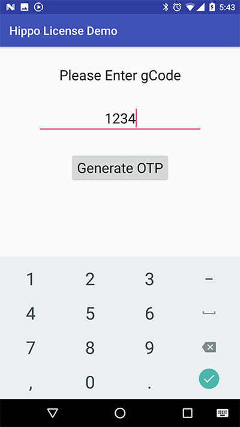
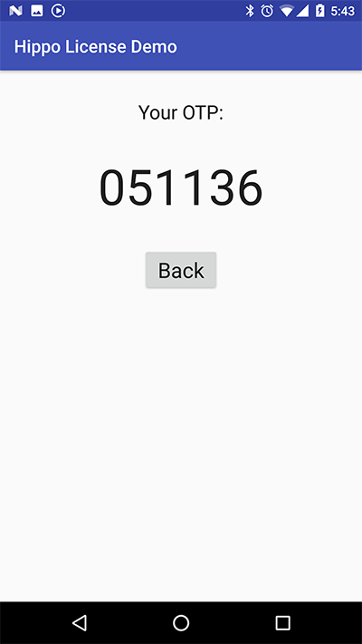

# HippoLicense Toolkit

HippoLicense demo project for Android client.

## Prerequisite

Please contact HippoSecurity support to obtain your copy of the library  `hippo-lib-release.aar`, and copy the binary file into `~/hippo-lib/` folder in the project.

## Build and run the demo

Open the project with latest version of Android Studio.

The first screen will prompt user to enter `gCode` (user should run HippoLicense server side demo to get the gCode):



User enter `gCode` and tap on the `Generate OTP` button, it will jump to the second screen to display generated OTP code:



User can then enter the OTP back to server side for verification.

## Integration

Copy the `MainActivity` and `ResultActivity` into your project, remember to modify `getHostInfo()` method in their common parent `BaseActivity` to get `licenseKey` and `hostId` from your target server, and get `licenseCount` from your backend system.

```Java
protected void getHostInfo() {
    // GET Host Information by e.g. scanning QR Code
    licenseKey = "LICENSE_KEY";
    hostId = "112233DDEEFF";
    // GET License Count from e.g. CRM system
    licenseCount = 12;
}
```

## License

MIT © HippoSecurity
